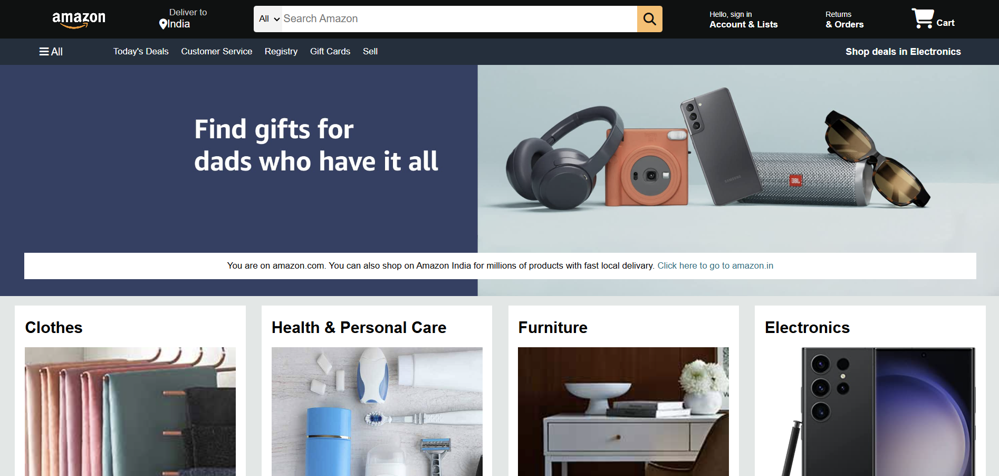

# 🛍️ Amazon Clone - Frontend Project

A visually accurate clone of the Amazon.com homepage built using **HTML** and **CSS**. This project focuses on layout structuring, responsive design principles, and UI/UX elements using pure front-end technologies — no JavaScript functionality or backend included yet.

---

## 📸 Preview

---

## 🛠️ Tech Stack

- ✅ HTML5
- ✅ CSS3
- ✅ Font Awesome (for icons)
- ✅ Flexbox & Responsive Design

---

## ✨ Features

- 📌 **Sticky Navigation Bar**
- 🔍 **Search Bar with Icon**
- 📦 **Product Grid Layout**
- 🎁 **Promotional Hero Section**
- 📃 **Fully Styled Footer**
- 🌐 **Responsive Layout for Medium Screens**
